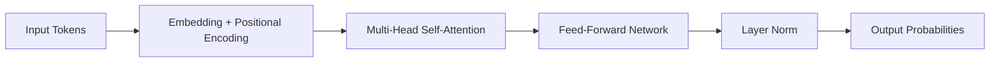

# Understanding Transformers

This note exercises every block type in the schema — one of each, including all container blocks and callout variants.

## Headings

### Level 3 Heading

#### Level 4 Heading

##### Level 5 Heading

###### Level 6 Heading

---

## Code

```typescript
function attend(query: number[], keys: number[][]): number[] {
  // Scaled dot-product attention
  const scores = keys.map(k => dot(query, k) / Math.sqrt(query.length));
  return softmax(scores);
}
```

## Math

$$
\text{Attention}(Q, K, V) = \text{softmax}\left(\frac{QK^T}{\sqrt{d_k}}\right)V
$$

## Callouts

> **Info**
> This is an **info** callout. Useful for supplementary information.

> **Warning**
> This is a **warning** callout. Something might go wrong.

> **Error**
> This is an **error** callout. Something has gone wrong.

> **Tip**
> This is a **tip** callout. A helpful shortcut or trick.

> **note**
> A **note** callout with no custom title — the variant name is used instead.

## Quote

> The transformer architecture replaces recurrence with attention, enabling parallelism across sequence positions.
>
> — Vaswani et al., 2017

## Lists

- Self-attention operates over the full sequence in parallel
- Multi-head attention captures different relationship types
- Positional encoding injects sequence order information

1. Tokenise the input sequence
2. Compute query, key, and value projections
3. Apply scaled dot-product attention
4. Feed through position-wise FFN

## Todo

- [x] Read the original Attention Is All You Need paper
- [x] Implement a single attention head from scratch
- [ ] Benchmark against an RNN baseline
- [ ] Write up findings in a note

## Table

| Block Type | Category | Nests Blocks |
| --- | --- | --- |
| text | leaf | no |
| heading | leaf | no |
| code | leaf | no |
| callout | leaf | no |
| details | container | yes |
| tabs | container | yes |
| columns | container | yes |

## Image


*A simplified view of multi-head attention*

## Gallery

## Video

[▶ Video](https://www.w3schools.com/html/mov_bbb.mp4)

## File

[📎 attention-is-all-you-need.pdf](https://arxiv.org/pdf/1706.03762)

## Embeds

[Embed](https://www.youtube.com/watch?v=rBCqOTEfxvg)

## Mermaid



## Collection

## Container Blocks

<details>
<summary>Implementation notes — click to expand</summary>

These details are collapsed by default. Good for supplementary material, spoilers, or long digressions.

```python
import torch
import torch.nn.functional as F

def scaled_dot_product_attention(Q, K, V):
    d_k = Q.size(-1)
    scores = torch.matmul(Q, K.transpose(-2, -1)) / d_k ** 0.5
    weights = F.softmax(scores, dim=-1)
    return torch.matmul(weights, V)
```

</details>

**Python**

```python
from transformers import AutoTokenizer, AutoModel

tokenizer = AutoTokenizer.from_pretrained('bert-base-uncased')
model = AutoModel.from_pretrained('bert-base-uncased')
inputs = tokenizer('Hello, world!', return_tensors='pt')
outputs = model(**inputs)
```

**TypeScript**

```typescript
import { pipeline } from '@huggingface/transformers';

const generator = await pipeline('text-generation', 'gpt2');
const result = await generator('The transformer architecture');
console.log(result);
```

> **Tip**
> BERT-style models. Good for classification and understanding tasks.

> **Decoder-only**
> GPT-style models. Good for generation tasks and language modelling.
